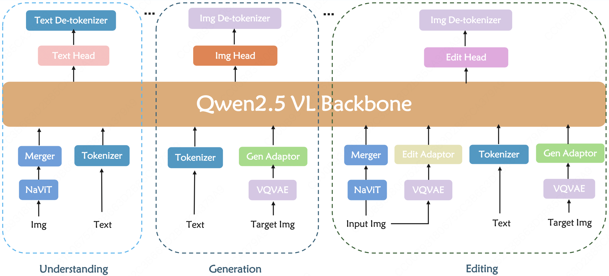

# A Simple Baseline for Unifying Understanding, Generation, and Editing via Vanilla Next-token Prediction

<div align="center" style="line-height: 1;">
  <a href="https://arxiv.org/abs/2603.04980" target="_blank" style="margin: 2px;">
    
  </a>
  <a href="https://huggingface.co/jiezhueval/Wallaroo" target="_blank" style="margin: 2px;">
    
  </a>
</div>


<p align="center">
  
</p>

## Why we develop Wallaroo?

It is widely acknowledged that unifying understanding, generation, and editing has become an inevitable trend. To achieve this, autoregressive paradigm, as a representative choice, has been naturally considered. To advance this direction and establish a benchmark, we introduce Wallaroo,  a straightforward autoregressive baseline that leverages next-token prediction to unify multi-modal understanding, image generation and editing at the same time. Moreover, Wallaroo supports multi-resolution image input and output, as well as bilingual support for both Chinese and English. In a nutshell, Wallaroo is a comprehensive comparison baseline model.

## Getting Started

### Installation

- Install 64-bit Python 3.10.14 and PyTorch 2.4.0+cu121
- Install Python libraries with:
  
  ```bash
  pip3 install -r requirements.txt
  ```
- Download the [Wallaroo 7B](https://huggingface.co/jiezhueval/Wallaroo)
- Download the  [LLamaGen Tokenizer](https://huggingface.co/peizesun/llamagen_t2i/resolve/main/vq_ds16_t2i.pt)

### Evaluation

#### Visual Understanding

- Download the [VLMEvalKit](https://github.com/open-compass/VLMEvalKit)
- Add the code in vlm/qwen2_vl/model.py 313L to allow Wallaroo 7B checkpoint loading
```
else:
    self.model = MODEL_CLS.from_pretrained(
        model_path, torch_dtype='auto', device_map="auto", attn_implementation='flash_attention_2'
    )

    load_wallaroo = True

    if load_wallaroo:

        load_from = "path/to/checkpoint"

        resume_checkpoint = torch.load(load_from, map_location="cpu")
        new_dict = {}
        for key, value in resume_checkpoint['state_dict'].items():
        
        if 'visual' in key:
            new_dict[key.replace('wallaroo', 'model')] = value

        elif 'model' in key:
            new_dict[key.replace('model', 'language_model').replace('wallaroo', 'model')] = value

        elif 'lm_head' in key:
            new_dict['lm_head.weight'] = value


        m, u = self.model.load_state_dict(new_dict, strict=False)
        del resume_checkpoint

    self.model.eval()
```
- Follow the instructions in VLMEvalKit

#### Image Generation

```
cd scripts/evaluate
sh test_ar_t2i.sh
```

#### Image Editing

```
cd scripts/evaluate
sh test_ar_i2i.sh
```

### Training

See examples/wallaroo/ar_wallaroo_7

This folder contains the config yaml files and corresponding training python files from different stages.

One can see detailed command in train_script.sh.

## Citation
```
@article{Zhu2026Simple,
title   = {# A Simple Baseline for Unifying Understanding, Generation, and Editing via Vanilla Next-token Prediction},
author  = {Jie Zhu, Hanghang Ma, Jia Wang, Yayong Guan, Yanbing Zeng, Lishuai Gao,
Junqiang Wu, Jie Hu, Leye Wang},
journal = {arXiv preprint arXiv:2603.04980},
year    = {2026}
}
```


## Acknowledgments

This work is built on Qwen2.5 VL, Show-o, and LLamaGen. Thanks for their wonderful open-source work.

